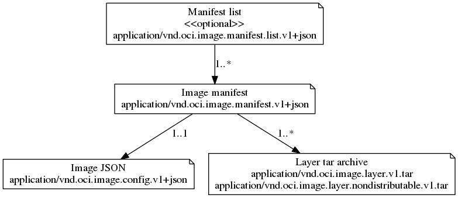

# Media Types

The following media types identify the formats described here and their referenced resources:

- `application/vnd.oci.descriptor.v1+json`: [Content Descriptor](descriptor.md)
- `application/vnd.oci.image.manifest.list.v1+json`: [Manifest list](manifest.md#manifest-list)
- `application/vnd.oci.image.manifest.v1+json`: [Image manifest format](manifest.md#image-manifest)
- `application/vnd.oci.image.layer.tar+gzip`: ["Layer", as a gzipped tar archive](layer.md)
- `application/vnd.oci.image.config.v1+json`: [Container config JSON](serialization.md)

## Compatibility Matrix

The OCI Image Specification strives to be backwards and forwards compatible when possible.
Breaking compatibility with existing systems creates a burden on users whether they be build systems, distribution systems, container engines, etc.
This section shows where the OCI Image Specification is compatible with formats external to the OCI Image and different versions of this specification.

### application/vnd.oci.image.manifest.list.v1+json

**Similar/related schema**

- [application/vnd.docker.distribution.manifest.list.v2+json](https://github.com/docker/distribution/blob/master/docs/spec/manifest-v2-2.md#manifest-list) - mediaType is different

### application/vnd.oci.image.manifest.v1+json

**Similar/related schema**

- [application/vnd.docker.distribution.manifest.v2+json](https://github.com/docker/distribution/blob/master/docs/spec/manifest-v2-2.md#image-manifest-field-descriptions)

### application/vnd.oci.image.rootfs.tar.gzip

**Interchangeable and fully compatible mime-types**

- [application/vnd.docker.image.rootfs.diff.tar.gzip](https://github.com/docker/docker/blob/master/image/spec/v1.md#creating-an-image-filesystem-changeset)

### application/vnd.oci.image.config.v1+json

**Similar/related schema**

- [application/vnd.docker.container.image.v1+json](https://github.com/docker/docker/blob/master/image/spec/v1.md#image-json-description)

## Relations

The following figure shows how the above media types reference each other:

A reference is defined as the target content digest, as defined by the [Registry V2 HTTP API Specificiation](https://docs.docker.com/registry/spec/api/#digest-parameter).
The manifest list being a "fat manifest" references one or more image manifests per target platform. An image manifest references exactly one target configuration and possibly many layers.
