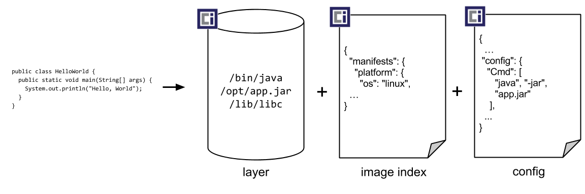
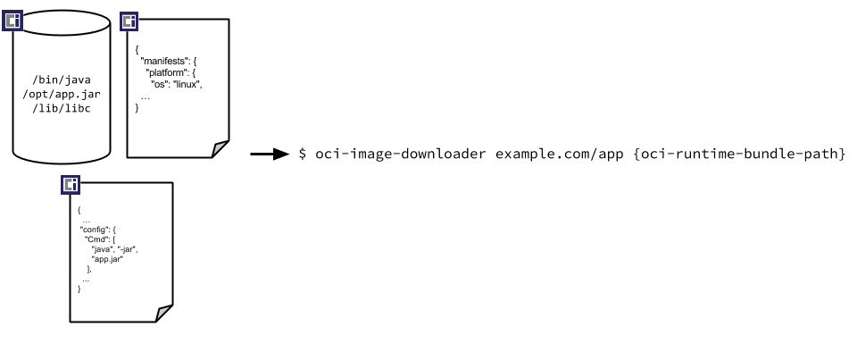

# Open Container Initiative Image Format Specification

This specification defines an OCI Image, consisting of a [manifest](manifest.md), a [manifest list](manifest-list.md) (optional), a set of [filesystem layers](layer.md), and a [configuration](config.md).

The goal of this specification is to enable the creation of interoperable tools for building, transporting, and preparing a container image to run.

## Table of Contents

- [Introduction](spec.md)
- [Notational Conventions](#notational-conventions)
- [Overview](#overview)
    - [Components](#componets)
    - [Actions](#actions)
    - [Packing Images](#packing-images)
    - [Unpacking Images](#unpacking-images)
    - [Media Types](#media-types.md)
- [Content Descriptors](descriptor.md)
- [Image Layout](image-layout.md)
- [Image Manifest](manifest.md)
- [Image Manifest List](manifest-list.md)
- [Filesystem Layers](layer.md)
- [Image Configuration](config.md)
- [Annotations](annotations.md)
- [Considerations](considerations.md)
    - [Extensibility](considerations.md#extensibility)
    - [Canonicalization](considerations.md#canonicalization)

# Notational Conventions

The key words "MUST", "MUST NOT", "REQUIRED", "SHALL", "SHALL NOT", "SHOULD", "SHOULD NOT", "RECOMMENDED", "MAY", and "OPTIONAL" are to be interpreted as described in [RFC 2119](http://tools.ietf.org/html/rfc2119) (Bradner, S., "Key words for use in RFCs to Indicate Requirement Levels", BCP 14, RFC 2119, March 1997).

The key words "unspecified", "undefined", and "implementation-defined" are to be interpreted as described in the [rationale for the C99 standard][c99-unspecified].

An implementation is not compliant if it fails to satisfy one or more of the MUST, REQUIRED, or SHALL requirements for the protocols it implements.
An implementation is compliant if it satisfies all the MUST, REQUIRED, and SHALL requirements for the protocols it implements.

# Overview

## Components

The [OCI Image Media Types](media-types.md) document is a starting point to understanding the overall structure of the specification.

The high-level components of the spec include:

* An archival format for container images, consisting of an [image manifest](manifest.md), a [manifest list](manifest-list.md) (optional), an [image layout](image-layout.md), a set of [filesystem layers](layer.md), and [image configuration](config.md) (base OCI layer)
* A [process of referencing container images by a cryptographic hash of their content](descriptor.md) (base OCI layer)
* A format for [storing CAS blobs and references to them](image-layout.md) (optional OCI layer)
* Signatures that are based on signing image content address (optional OCI layer)
* Naming that is federated based on DNS and can be delegated (optional OCI layer)

## Actions

The specified [components](#components) MAY be manipulated with actions.

* **pack**: Create a blob from the local filesystem (or other storage).
* **unpack**: Update the local filesystem (or other storage) based on data found in a blob.
* **validate**: Verify that blobs [comply](#notational-conventions) with the specification for their [media type](media-types.md).
    Blobs can be validated on their own (**intra-blob validation**) or recursively including [referenced](descriptor.md) ancestors (**recursive validation**).
* **translate**: Convert a blob between similar formats.
    Translation may be **lossy** or **lossless** depending on how well the formats align.
* **put**: Add a blob to content-addressable storage like [image layout's `blobs`](image-layout.md#blobs) or a reference to location-addressable storage like [image layout's `refs`](image-layout.md#refs).
* **get**: Retrieve a blob from content-addressable storage like [image layout's `blobs`](image-layout.md#blobs) or a reference from location-addressable storage like [image layout's `refs`](image-layout.md#refs).
* **delete**: Remove a blob from content-addressable storage like [image layout's `blobs`](image-layout.md#blobs) or a reference from location-addressable storage like [image layout's `refs`](image-layout.md#refs).

## Packing Images

In packing a new image, an example workflow is:

* The [bundle][]'s [root filesystem][runtime-spec-root] is packed into a [layer](layer.md) (or layers) which are put into content-addressable storage.
* The [bundle's `config.json`][bundle] is translated into an [image configuration](config.md) which is put into content-addressable storage.
* The image configuration and layer(s) are packed into a [manifest](manifest.md) which is put into content-addressable storage.
* That manifest (and potentially other manifests) are packed into a [manifest-list](manifest-list.md) (optional) which is put into content-addressable storage.
* A reference to the manifest-list (and/or manifest) is put into location-addressable storage.

## Unpacking Images

In unpacking an existing image, an example workflow is:

* Get an image reference from location-addressable storage like [image layout's `refs`](image-layout.md#refs) or an index based on the [associated annotations](descriptor.md#properties).
* Get the referenced [manifest-list](manifest-list.md) (optional) from content-addressable storage, validate it, and unpack it to find the appropriate [manifest](manifest.md) for the target platform.
* Get the referenced [manifest](manifest.md) from content-addressable storage, validate it, and unpack it to find the [image configuration](config.md) and [layer(s)](layer.md).
* Get the referenced [layer(s)](layer.md) from content-addressable storage, validate it, and unpack it into the [bundle][]'s [root filesystem][runtime-spec-root].
* Get the referenced [image configuration](config.md) from content-addressable storage, validate it, and translate it to a [runtime configuration][runtime-spec-config].
    Write the translated configuration to the [bundle's `config.json`][bundle].

[c99-unspecified]: http://www.open-std.org/jtc1/sc22/wg14/www/C99RationaleV5.10.pdf#page=18
[bundle]: https://github.com/opencontainers/runtime-spec/blob/v1.0.0-rc2/bundle.md
[runtime-spec-root]: https://github.com/opencontainers/runtime-spec/blob/v1.0.0-rc2/config.md#root-configuration
[runtime-spec-config]: https://github.com/opencontainers/runtime-spec/blob/v1.0.0-rc2/config.md
